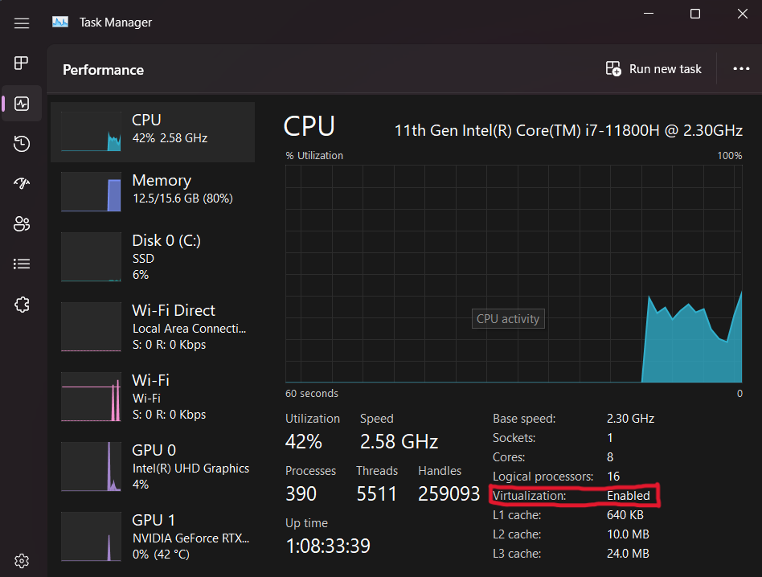

# WSL

In this section we will install WSL. This is a virtualized Linux Kernel for Windows. This makes managing developer tools far easier and separates your development OS (Linux) from your personal OS (Windows).

> Note: This section only applies to Windows users.

## Update Windows and Virtualization Check

Before we begin, it is best to ensure we have the most recent Windows update available. Go to **Settings > Updates** and install any updates to your system.

Secondly, you will want to ensure that virtualization is enabled on your device. To do this open 'Task Manager', click more details, open the performance tab and make sure you are on the CPU performance section. In the details below the CPU's graph there should be an option called 'virtualization'. This should have the value 'Enabled' next to it. If it doesn't, you will need to enable a feature called SVM in your computers BIOS. If you are comfortable doing this; go for it but if you do not want to do this yourself do not worry. We will ensure everyone is setup correctly in the first meetup. Continue reading through as there will be a way you can start coding at the end of the sections.



## Windows Terminal

To get started with WSL we will want a new terminal environment for the WSL shell. Fortunately, Microsoft has an awesome project called Windows Terminal (WT). It is able to hold many instances of different shells an dis fully customizable. To install it, simply open the [Microsoft Store](https://www.microsoft.com/store/productId/9N0DX20HK701) apps and search for "Windows Terminal" and click "install".

## WSL Install

To install WSL, we need to open PowerShell terminal with administrative privileges. Click on the Windows Start button (bottom left icon on the sectionbar) and type "PowerShell", select "Run as Administrator". This will open a new shell. Now run:

```ps
> wsl --install -d Ubuntu-20.04
```

This may require a reboot. This will install WSL as well as an image of Ubuntu. Click Start again and type "Ubuntu" and run the application. Follow the on screen instructions to create your user and password for WSL. This is different from you Windows credentials. Now open WT and press `ctrl + ,` again. On the settings page that pops up, the first drop down called "Default Profile" should now have an option called Ubuntu (or something similar). Choose this as your default profile.

WSL is now installed. Create a new shell tab with `ctrl + shift + t` and the shell prompt should now display you WSL username.

> ### Command Line Notation
>
> In this chapter and throughout the book, we’ll show some commands used in the
> terminal. Lines that you should enter in a terminal all start with `$`. You
> don’t need to type the `$` character; it’s the command line prompt shown to
> indicate the start of each command. Lines that don’t start with `$` typically
> show the output of the previous command. Additionally, PowerShell-specific
> examples will use `>` rather than `$`.

### APT & Packages

Before you begin, you will need to update your systems packages. Packages on Ubuntu are managed by a tool called `apt`. For some context, updating packages takes two steps typically, first you update the package index, then you can update the relevant packages.

```sh
# `sudo` represents 'super user do'. 
# This runs a command with admin. privileges.
# Update apt's local package index.
$ sudo apt update

# The `-y` flag means upgrade yes to all.
# This bypasses confirming package upgrades.
# Upgrade packages with new versions
$ sudo apt upgrade -y
```

You will also want some packages `apt` that we will need for C++ development.

```sh
# Installs specified packages (separated by spaces).
$ sudo apt install git curl wget ca-certificates build-essential
```

WSL should be installed and ready to go.
